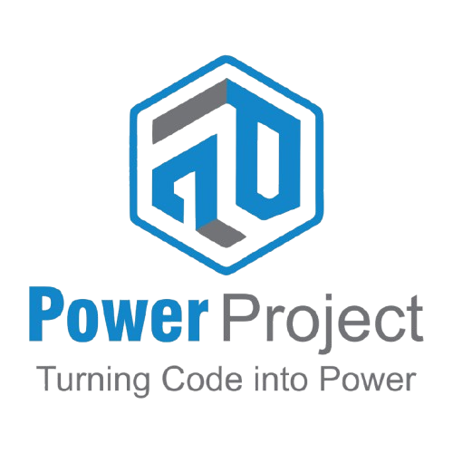

# 🚀 PowerProject - AI-Powered Software Development Company

**Transform your ideas into cutting-edge software solutions with our expert team**

## 🌟 About PowerProject

PowerProject is a leading software development company specializing in **AI-powered solutions**, **custom development**, and **mobile applications**. With over **8+ years of experience** and **300+ successful projects**, we deliver cutting-edge software solutions that drive business growth in the digital age.

### 🎯 Our Mission
To transform innovative ideas into powerful software solutions that drive business growth and success in the digital age.

## 🛠️ What We Offer

### 💻 **Custom Software Development**
- **Web Applications** - Full-stack solutions with modern frameworks
- **Desktop Applications** - Cross-platform desktop software
- **API Development** - RESTful and GraphQL APIs
- **Microservices Architecture** - Scalable and maintainable systems
- **Legacy System Modernization** - Upgrade and migrate existing systems

### 📱 **Mobile App Development**
- **iOS Applications** - Native iOS apps with Swift/Objective-C
- **Android Applications** - Native Android apps with Kotlin/Java
- **Cross-Platform Apps** - React Native, Flutter, Xamarin solutions
- **Progressive Web Apps** - Web-based mobile experiences
- **App Store Optimization** - Complete app lifecycle management

### 🤖 **AI & Machine Learning Solutions**
- **AI Integration** - Implement AI features in existing applications
- **Machine Learning Models** - Custom ML solutions for business needs
- **Natural Language Processing** - Chatbots and language understanding
- **Computer Vision** - Image and video analysis solutions
- **Predictive Analytics** - Data-driven business insights

### ☁️ **Cloud & DevOps Services**
- **Cloud Migration** - AWS, Azure, Google Cloud deployment
- **DevOps Implementation** - CI/CD pipelines and automation
- **Containerization** - Docker and Kubernetes solutions
- **Infrastructure as Code** - Automated infrastructure management
- **Monitoring & Security** - 24/7 system monitoring and security

### 🎨 **UI/UX Design & Development**
- **User Interface Design** - Modern, intuitive user experiences
- **User Experience Research** - Data-driven design decisions
- **Prototyping** - Interactive prototypes and wireframes
- **Design Systems** - Consistent design language across products
- **Accessibility** - WCAG compliant, inclusive design

## 🛠️ Tech Stack

| Frontend | Backend | Database | DevOps | AI/ML |
|----------|---------|----------|---------|-------|
| ⚛️ React | 🟢 Node.js | 🍃 MongoDB |  | 🐍 Python |
| ▲ Next.js | 🔷 TypeScript |  |  | 🤖 AI Solutions |
| 🎨 Tailwind | ☁️ AWS | 🔴 Redis | 🚀 CI/CD | 📊 Analytics |

## 🎮 Live Demo

Experience the cyberpunk website: **[View Live Site](https://powerproject-ltd.github.io/powerproject-ltd/)**

## 📦 Installation & Setup

### Prerequisites
- Node.js 18+ 
- npm or yarn
- Git

